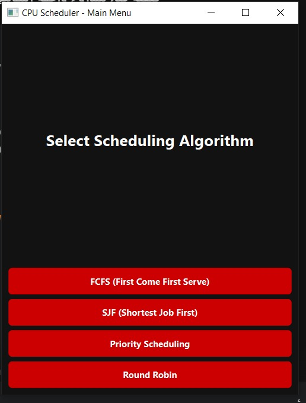
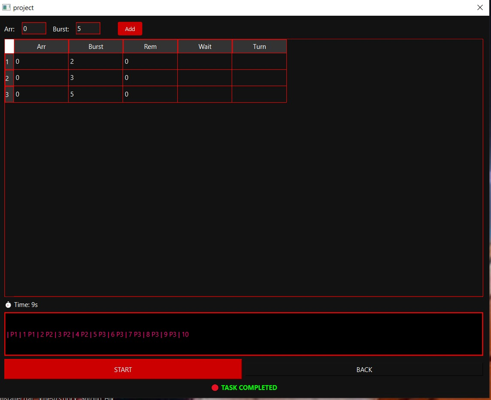

# 💻 CPU Scheduling Simulator (Qt/C++)

## 📝 Project Overview
A professional desktop application built with **C++** and **Qt Framework** to simulate and visualize various CPU scheduling algorithms. The app provides a clean, unified interface for all scheduling types, ensuring a seamless user experience.

## 🚀 Key Features
* **Unified Interface:** All algorithms share the same sleek dark-themed layout.
* **Dynamic Inputs:** The interface intelligently adapts, showing only the extra fields (like Priority or Quantum) needed for the selected algorithm.
* **Real-time Gantt Chart:** Visual execution of processes second by second.
* **Comprehensive Algorithms:** Supports FCFS, SJF, Priority, and Round Robin.

## 📸 App Preview

### 1. Main Menu
This is the starting point where you can choose your preferred scheduling algorithm.

### 2. Simulation Interface
Once an algorithm is selected, the unified simulation screen appears. Here you can add processes and watch the execution. 
*(Note: Extra input fields appear dynamically based on the chosen mode).*

## 🛠 Technologies Used
* **C++** (Core Logic)
* **Qt Creator** (UI & Framework)
* **CSS/Qt Stylesheets** (Dark Red Theme)

## 👩‍💻 Developed by
* **Shahinda Gamal Eldawi**
* Computer Engineering Student @ Ain Shams University
